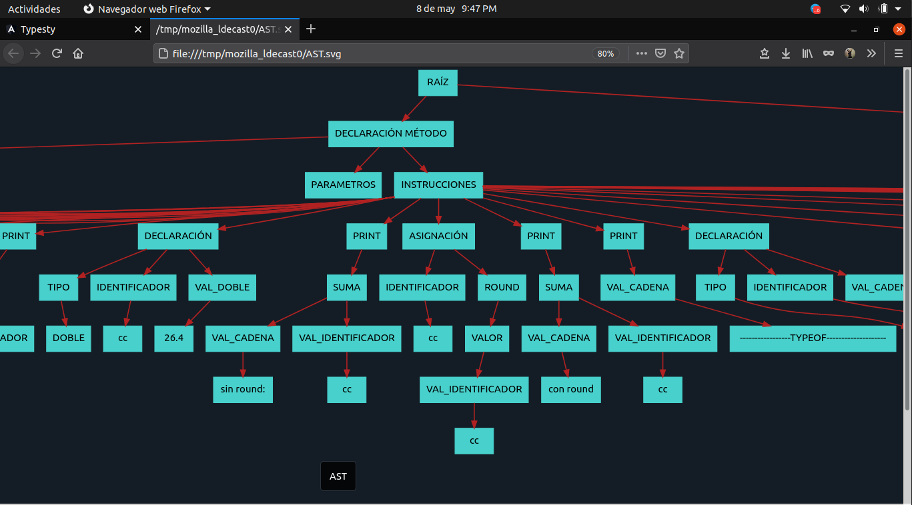

# MANUAL DE USUARIO

## Introducción
El siguiente manual tiene como fin introducir al usuario al manejo y conocimiento de TYPESTY para su uso funcional.  

### __Typesty__

El curso de Organización de Lenguajes y Compiladores 1, perteneciente a la Facultad
de Ingeniería de la Universidad de San Carlos de Guatemala, ha quedado satisfecho
con el programa REGEXIVE (que previamente ha entregado), por lo que nuevamente
se interesan en usted para generar el lenguaje Typesty, que será un intérprete para
que los estudiantes de Introducción a la Programación y Computación 1 utilicen para
sus primeras prácticas.

El software desarrollado cuenta con dos distintas ventanas de opciones para que el usuario pueda interactuar y hacer uso de la misma, las cuales se detallan más adelante.
  

## Ventana principal

  

En ella el usuario puede acceder a cada una de las funcionalidades de la aplicación y visualizar los reportes de símbolos y errores.

  

  

Barra de herramientas para que el usuario pueda seleccionar la que desee.
  

  

Panel de texto donde el usuario podrá ingresar sus archivos .ty o bien escribir uno desde cero.
  

  

Consola de salida donde se brindará el resultado de la codificación del intérprete con cadenas resultantes según el código ingresado.
  

  

Árbol de análisis sintáctico que se genera al presionar el botón Reporte AST y que se descarga en formato SVG.
  

  

Tabla de todas las variables declaradas por el usuario que se mantienen en memoria.
  

## Funciones

### Compilar
Al hacer clic en este botón se realizará un análisis y procesamiento por parte del intérprete que devolverá el resultado en la consola y tablas correspondientes.
  

### Abrir

  

Permite cargar en el editor un archivo .ty
  

### Guardar

  

Permite guardar en la computadora un archivo .ty
  

### Nueva pestaña
Abre una pestaña nueva dentro del explorador para tener más editores abiertos.
  

### Cerrar pestaña
Elimina la pestaña seleccionada del navegador.
  

### Reporte AST
Descarga un archivo .svg del árbol de análisis sintáctico a partir de la entrada.

 

 

### Manejo de errores:

Es frecuente que puedan ocurrir ciertos errores al momento de ingresar datos y manejar las funciones del administrador, para ello se le retornará una tabla de errores dento del html con todos los errores tanto léxicos como sintácticos y semánticos para informar sobre el error.

  

Tabla de errores léxicos, sintácticos y semánticos en forma de tabla en caso se detecten a partir del código fuente.
  

  

## Comentarios:
Los comentarios son una forma elegante de indicar que función tiene cierta sección del código que se ha escrito simplemente para dejar algún mensaje en específico. El lenguaje soporta dos tipos de comentarios que son los siguientes:

- Comentarios de una línea: Estos comentarios deberán comenzar con // y terminar con un salto de línea.
- Comentario multilínea: Estos comentarios deberán comenzar con /* y terminar con */.
 

Cada instrucción se delimita utilizando punto y coma ';'.
  

**Notas:**
- Los errores semánticos también serán desplegados dentro de la consola.
- Solamente se puede hacer uso de una sentencia EXEC en todo el programa.

 

## Ejemplos de archivo de entrada válido:
https://github.com/erclem1998/ArchivosPruebaOLC1/tree/master/Proyecto2/Pruebas
  

## Soporte técnico

luis.danniel@hotmail.com